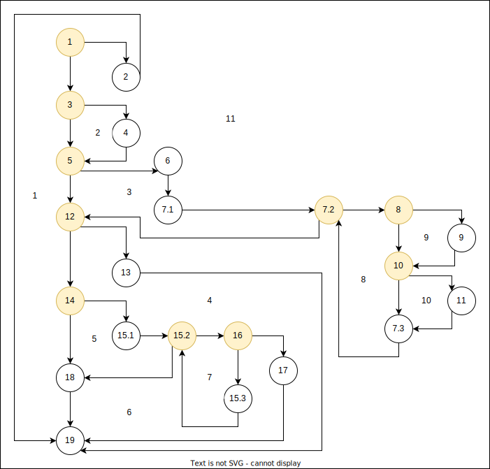

# Втора лабораториска вежба по Софтверско инженерство

------
## Луција Тонковиќ, бр. на индекс 216062

------
### Control Flow Graph

Некои линии код (кои би се изминале секогаш една по една секвенцијално/заедно) 
се споени во еден ист јазол, со цел поубаво да се прикаже графот. Во прикачениот код, 
во класата *SILab2* во функцијата *function*, ставени се коментари со кои може точно да 
се воочи со кој број е означена одредена линија од кодот (или група линии, доколку СЕКОГАШ
мора да се извршат заедно, т.е. ако програмата помине низ една од нив, сигурно би поминала
и низ останатите линии од таа група).

### Цикломатска комплексност

Цикломатската комплекснот на кодот е 11.
Има неколку начини на кои би можело да се пресмета истата:
* Со броење на сите региони во графот. Јасно може да се видат 11-те региони,
означени на сликата подолу.
* Со броење на сите предикатни јазли и додавање на 1. На сликата истите
се обоени во жолта боја. Може да воочиме дека такви јазли има 10, и со 
додавање на 1 добиваме 11.
* Со помош на Ојлеровата формула, која гласи *e - v + 2*, што го дава бројот
на региони во еден граф, каде *е* означува број на ребра, а *v* означува број
на јазли во графот. Во овој граф има 32 ребра и 23 јазли, па добиваме 32-23+2=11.

### Тест случаи според критериумот Every Branch

Во табелата подолу се прикажани 5 тест случаи, со кои се минува низ сите можни ребра
во Control Flow графот, па е исполнет Every Branch критериумот. За да има пократок
приказ во табелата, во листата подолу е подетално прикажано кои информации ги содржат 
променливите user1, user2, ..., user7, и од кои users се состојат листите list1 и list2:
* user1 = null;
* user2 = new User("name", "name1234", "email@gmail.com");
* user3 = new User(null, "p@ssw0rd", "email@gmail.com");
* user4 = new User("name", "s0m3th!ng3ls3", "other@gmail.com");
* user5 = new User("username", "0th3rp@ss", "email@gmail.com");
* user6 = new User("username123", "p@ss w0rd", "email");
* user7 = new User("username123", "passw0rd", "email");
* list1 = List.of(user4, user5);
* list2 = new ArrayList<User>(); - немаме претходни постоечки корисници

Во првиот тест случај, предадениот објект user за кого проверуваме дали е валиден
е null, па ќе се пројдат соодветните ребра означени со 1 од втората колона, т.е.
ќе се фрли Runtime Exception, и кодот понатака нема да се изврши (затоа само 2 ребра
се изминати). Во табелата се гледа дека за параметарот allUsers е ставено X, бидејќи 
не е важно каква листа ќе предадеме на функцијата во овој случај (кодот 
нема да стигне до дел каде што тоа би било релевантно).

За вториот тест случај, резултатите се прикажани во третата колона. Во листата постоечки
корисници, username-от на корисникот user4 се поклопува со она на user2 за кого проверуваме
дали е валиден корисник, а e-mail адресатa се поклопува со онаа на user5. Поради ова, всушност,
ќе се изминат сите можни ребра опфатени со делот од кодот во првиот for циклус (каде се
брои колку пати ни се поклопува username-oт или email-от со на некој од постоечките 
корисници). Бидејќи password-от ни е невалиден, во делот каде се проверува дали password-ot
ни содржи дел од username-от, во if-от ќе добиеме true, така што функцијата ќе врати false
според следната линија во кодот (остатокот од кодот нема да се извши, па соодветните ребра
за тој дел ќе бидат нули).

Во третиот тест случај, сакаме да ги поминеме ребрата 3-4 и 4-5, кои ги немавме поминато
претходно, поради што user3 имa null за username. Листата allUsers е празна, па ќе немаме
поклопување со друг корисник, same = 0 (во првиот циклусот нема ни да влеземе, ќе се изврши само
*i = 0*, условот *i < allUsers.size()* веднаш враќа false). Во делот со проверка на password-ot, 
тој е валиден и има специјален карактер, па кодот ќе заврши со командата return same == 0, кога ќе дојдеме 
до специјалниот знак во вториот for циклус (во втората итерација).

Реброто 5-12 ни недостасува, што значи ни треба тест случај каде email адресата не е валидна, па во 
четвртиот случај го земаме user=user6. Ни фали и реброто 14-18, т.е. случајот кога password-от содржи
празно место, што е покриено во овој тест случај. Не е важно која листа ја предаваме за allUsers, бидејќи
*for* циклусот каде таа листа би се користела се скока поради невалидниот email.

Последното ребро кое ни фали е 15.2-18, т.е. тоа е случајот кога password-от не ни содржи
специјален знак, и излегуваме од вториот *for* циклус (во третиот случај никогаш не излеговме од
цисклусот поради самиот услов во циклусот, туку циклусот заврши заради return). Последниот тест
случај е сличен со претходниот, со таа разлика што password-от наместо да има празно место, ќе 
нема специјален карактер, за да влеземе во вториот циклус.

Со тоа, опфатени се сите ребра од Control Flow графот.

| EveryBranch | user=user1, allUsers=X | user=user2, allUsers=list1 | user=user3, allUsers=list2 | user=user6, allUsers=X | user=user7, allUsers=X |
|:-----------:|:----------------------:|:--------------------------:|:--------------------------:|:----------------------:|:----------------------:|
|     1-2     |           1            |             0              |             0              |           0            |           0            |
|     1-3     |           0            |             1              |             1              |           1            |           1            |
|    2-19     |           1            |             0              |             0              |           0            |           0            |
|     3-4     |           0            |             0              |             1              |           0            |           0            |
|     3-5     |           0            |             1              |             0              |           1            |           1            |
|     4-5     |           0            |             0              |             1              |           0            |           0            |
|     5-6     |           0            |             1              |             1              |           0            |           0            |
|    5-12     |           0            |             0              |             0              |           1            |           1            |
|    6-7.1    |           0            |             1              |             1              |           0            |           0            |
|   7.1-7.2   |           0            |             1              |             1              |           0            |           0            |
|    7.2-8    |           0            |             1              |             0              |           0            |           0            |
|   7.2-12    |           0            |             1              |             1              |           0            |           0            |
|     8-9     |           0            |             1              |             0              |           0            |           0            |
|    8-10     |           0            |             1              |             0              |           0            |           0            |
|    9-10     |           0            |             1              |             0              |           0            |           0            |
|    10-11    |           0            |             1              |             0              |           0            |           0            |
|   10-7.3    |           0            |             1              |             0              |           0            |           0            |
|   11-7.3    |           0            |             1              |             0              |           0            |           0            |
|   7.3-7.2   |           0            |             1              |             0              |           0            |           0            |
|    12-13    |           0            |             1              |             0              |           0            |           0            |
|    12-14    |           0            |             0              |             1              |           1            |           1            |
|    13-19    |           0            |             1              |             0              |           0            |           0            |
|    14-18    |           0            |             0              |             0              |           1            |           0            |
|   14-15.1   |           0            |             0              |             1              |           0            |           1            |
|  15.1-15.2  |           0            |             0              |             1              |           0            |           1            |
|   15.2-16   |           0            |             0              |             1              |           0            |           1            |
|   15.2-18   |           0            |             0              |             0              |           0            |           1            |
|   16-15.3   |           0            |             0              |             1              |           0            |           1            |
|    16-17    |           0            |             0              |             1              |           0            |           0            |
|  15.3-15.2  |           0            |             0              |             1              |           0            |           1            |
|    17-19    |           0            |             0              |             1              |           0            |           0            |
|    18-19    |           0            |             0              |             0              |           1            |           1            |

### Тест случаи според критериумот Multiple Condition

За условот *if(user == null || user.getPassword() == null || user.getEmail()==null)* постојат
2^3, т.е. 8 можни комбинации на true/false. Бидејќи условот е составен од 3 дела
поврзани со логичко или (||), доколку барем еден од условите е исполнет, целиот израз би вратил
true. Затоа, кога еден услов е исполнет, сите оние по него воопшто не се ни проверуваат (ова се
нарекува и Lazy Evaluation). Според тоа, во табелата се дадени релевантните можни случаи, каде Т
означува ture, F означува false и X означува дека тој услов воопшто не е важен и не се проверува
(можеме да ставиме било што). За парамтератор allUsers за овие тест случаи можеме да ја предадеме
било која листа на функцијата *function*, бидејќи овој параметар не влијае на овој *if* услов.

| Multiple Condition | Можен тест случај                                      |
|:------------------:|:-------------------------------------------------------|
|       T,X,X        | user = null                                            |
|       F,T,X        | user = new User("name",null,null)                      |
|       F,F,T        | user = new User("name", "p@ssw0rd", null)              |
|       F,F,F        | user = new User("name", "p@ssw0rd", "email@gmail.com") |

### Објаснување за напишаните unit tests

Напомена: Во горниот дел на класата *SILab2Test* се инстанцирани сите променливи
user1, user2,...., list1 и list2, на истиот начин како што се прикажани во објаснувањето за
Еvery Branch критериумот.

Според критериумот Every Branch, добивме 5 тест случаи за да се покријат сите можни
ребра во графот. Поради тоа, во функцијата *everyBranchTest()* имаме 5 assert изрази,
т.ш. секој одговара на соодветниот тест случај од претходната табела:
* Во првиот тест случај, бидејќи user=null, поради првиот *if* услов, очекуваме 
програмата да фрли исклучок од тип RuntimeException со порака "Mandatory information missing!";
* Во вториот тест случај, бидејќи password-от на user (каде user=user2) ни го содржи username-от, 
password-от e невалиден, па очекуваме програмата да ни врати False;
* Во третиот тест случај, каде user=user3 и аllUsers=list2 (кои ги дефиниравме претходно), иако 
username=null, според логиката на кодот може да се заклучи дека тоа не се интерпретира како невалидно,
туку само се превема како username еmail-адресата. Листата на постоечки корисници не ни содржи корисник 
чии username или пак password се поклопува со на user, и финално, password-от на user не е пократок од 8 
карактери и содржи специјален знак (e валиден). Според оваа анализа, очекуваме функцијата да ни врати Тrue;
* Во четвртиот тест случај, каде user=user6, password-от на user содржи празно место, па според тоа 
очекуваме програмата да ни врати False;
* Во петтиот тест случај, каде user=user7, password-от на user не содржи специјален карактер, па очекуваме
вториот *for* циклус да заврши, и функцијата да ни врати false.

Според критериумот Multiple Condition, издвоивме 4 тест случаи. Заради поедноставување, не беа дефинирани нови
променливи во објаснувањето, ниту беа инстанцирани нови променливи на почеток на класата *SILab2Test*, туку директно во функцијата
*multipleConditionTest()* во самите assert изрази се креирани нови User oбјекти, а за allUsers параметарот се 
предадавани една од веќе постоечките листи list1 и list2. Имаме 4 assert изрази, од кои секој одговара на еден 
ред од табелата дадена во објаснувањето за Multiple Condition критериумот:
* Во првите 3 тест случаи, условот во *if*-от е исполнет, па очекуваме програмата да влезе во if-от
и да фрли исклучок од тип RuntimeException со порака "Mandatory information missing!"
* Во четвриот тест случај, условот во if-от не е задоволен, т.ш. очекуваме да не се фрли исклучок и 
програмата да продолжи. Даден е истиот пример како претходно, каде user=user3, a allUsers=list2, па очекуваме
функцијата да врати True(како што е веќе опишано во претходниот параграф). Може да се искористи било кој 
тест случај кој не би предизвикал фрлање на исклучокот, т.е. било кој од тестовите од претходниот параграф
освен првиот, каде user=user1 (а user1=null).